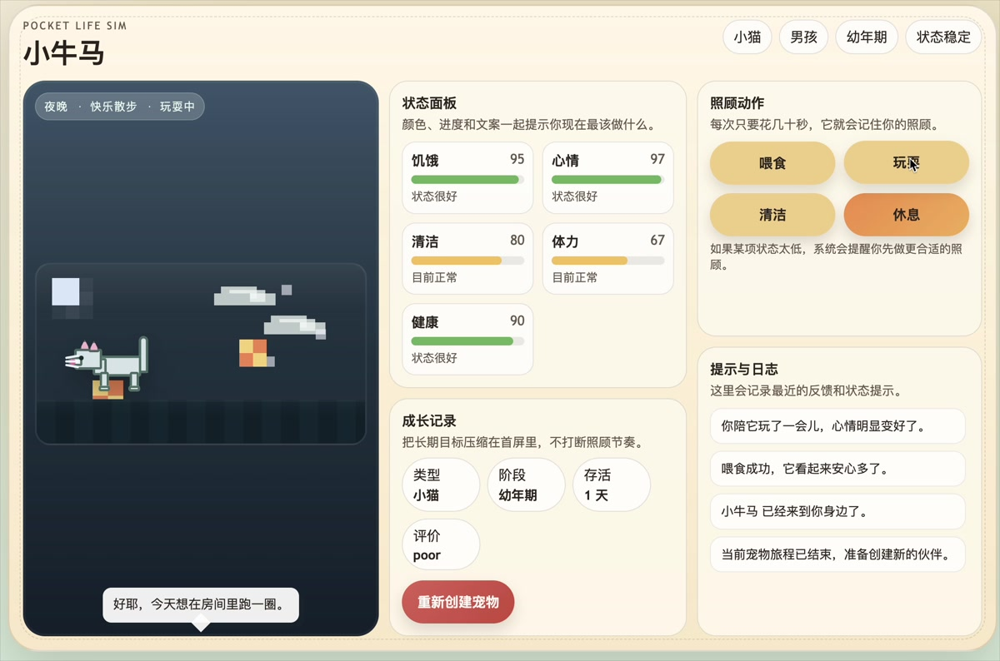
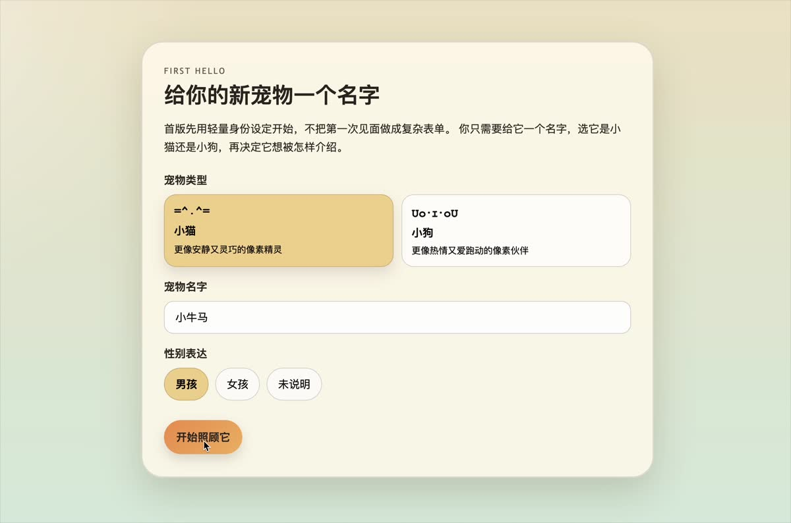

# AI Coding Pet

一个受拓麻歌子启发的像素风电子宠物项目。你可以给宠物取名、选择种类和性别表达，通过喂食、玩耍、清洁、休息等操作陪它成长，并在日常短时互动里观察它的状态变化。

> 当前仓库里最稳定、可正常体验的是 **浏览器版本**。  
> **桌面宠物版本** 正在开发中，已经有 Electron 外壳和桌面交互原型，但还没有完全达到可稳定运行的状态。

## 项目预览

以下画面来自项目开发录屏：

### 项目演示录屏

[](picture/ai-coding-pet-demo.mp4)

[点击查看完整录屏](picture/ai-coding-pet-demo.mp4)

### 首次创建宠物



### 浏览器版主界面


### 宠物种类


## 目前已经实现的内容

- 首次进入可创建宠物，并设置名字、性别表达、宠物种类
- 当前支持 `小猫`、`小狗`、`小猪`、`小狐狸`、`小乌龟` 共 5 种宠物
- 具备基础养成循环：`喂食`、`玩耍`、`清洁`、`休息 / 叫醒`
- 展示核心状态：`饥饿`、`心情`、`清洁`、`体力`、`健康`
- 有成长阶段、睡眠状态、提示文案和最近日志反馈
- 支持时间流逝、离线结算和本地存档恢复
- 使用像素风 UI 呈现更接近童年电子宠物的体验

## 版本说明

### 1. 浏览器版本

这是目前推荐体验的版本，也是当前仓库里完成度最高、可以正常运行的版本。

适合用来体验项目的核心玩法：

- 创建一只属于自己的宠物
- 查看状态变化
- 进行短时照顾互动
- 观察睡眠、提示、日志和成长反馈

### 2. 桌面宠物版本

这是我正在继续推进的第二阶段方向，希望把这个项目从“打开网页后照顾的宠物”，做成“会常驻桌面边缘陪伴你的桌面宠物”。

当前已经有的内容包括：

- Electron 桌面容器接入
- 桌面宠物窗口原型
- 托盘菜单和快捷动作入口
- 面向桌面形态的交互结构探索

目前还存在不足：

- 桌面宠物整体还不够稳定
- 交互和窗口行为还需要继续打磨
- 还没有完全达到可长期正常运行的程度

所以如果你第一次体验这个项目，建议先从浏览器版本开始。

## 技术栈

- React
- TypeScript
- Vite
- Electron
- Vitest

## 本地运行

### 浏览器版本

```bash
npm install
npm run dev
```

然后在浏览器中打开本地开发地址即可。

### 运行测试

```bash
npm test
```

### 桌面宠物版本（实验中）

```bash
npm run desktop:dev
```

如果你在 macOS 环境下，也可以尝试直接运行：

```bash
./start-desktop-pet.command
```

## 接下来想继续完善的方向

- 继续修复桌面宠物版本的运行问题
- 完善透明窗口、桌面悬浮、拖拽和点击逻辑
- 让宠物在桌面上拥有更自然的移动与待机行为
- 增加更完整的提示、成长反馈和陪伴感

## 项目说明

这个项目目前更像一个正在持续进化中的个人作品：

- 浏览器版已经能体现完整的核心玩法闭环
- 桌面版代表我正在尝试的下一步产品形态

如果你也喜欢电子宠物、像素风或者桌面陪伴类产品，欢迎看看这个项目，也欢迎交流想法。
